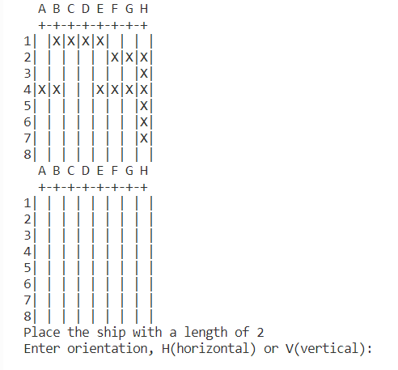
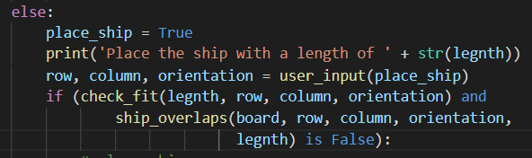
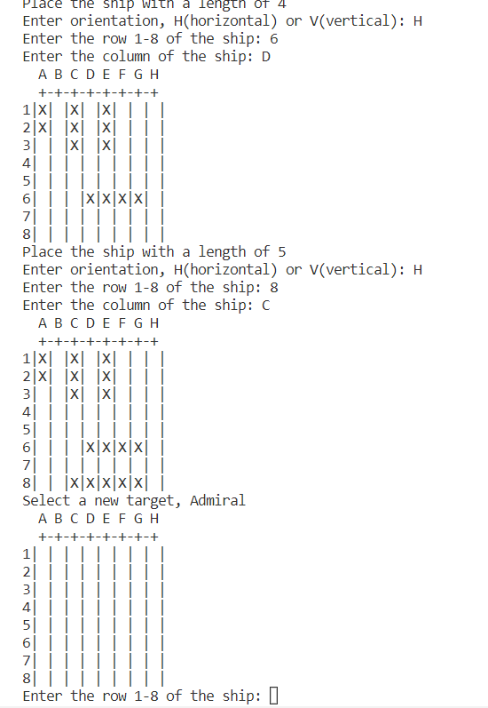
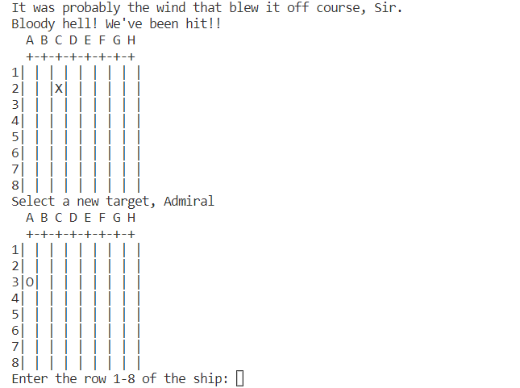
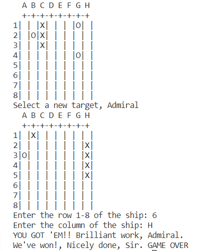
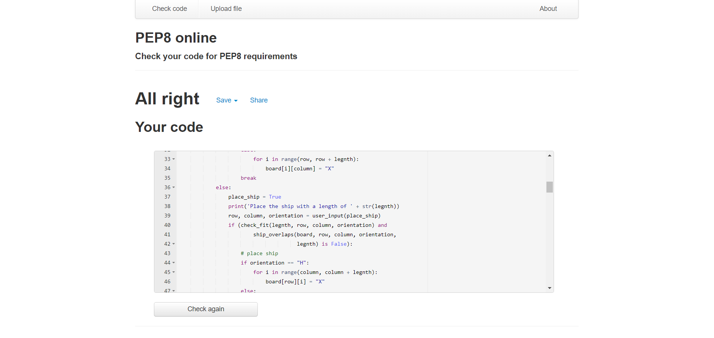

## Hello Code Institue

This is my submission for the third portfolio project. It's fundamentally a battleship game (see https://en.wikipedia.org/wiki/Battleship_(game) ) with some slight alterations to keep up the tempo and enhance replay ability.

## Start Game

Firstly, players are asked to place their battleships. The grid is 8*8 and each player has 5 ships ranging in length from 2 to 5 spaces long. Code has been written to prevent the player from placing ships overlapping each other.

Note that in the first screenshot the CPU's board and ships are visible. This has been so during the process of programing the game for the purpose of debugging. On line 149 of the run.py file, there is a line of code commented out. Remove the hashtag and the CPU ships will be revealed as above.

Once ships are placed the main gameplay loop begins.

The player is given frequent prompts to let them know exactly what is happening.

As it is the game is a race for the first to achieve 6 hits. I felt this to be an improvement over the standard formula, increasing the tempo of the game and encouraging replays while still being challenging.

## Testing

I have passed the code through a pep8 linter and there are no problems.

I have also tested it extensively by giving an incorrect command, imputing coordinates off grid and shooting the same location twice and at the time of writing this I can confirm there are no bugs.

## Notes 
Due to the inability to rely on gitpod to be available every day for me to work on my projects with I have taken to completing, to the largest extent, my projects locally on my laptop in Visual Studios. I feel that the risk of losing time in the morning, or sometime even a whole day, waiting for a workspace to open is not worth any supposed benefits that gitpod has to offer.

## Credits
https://www.pythoncheatsheet.org/

https://docs.python.org/3/tutorial/

https://en.wikipedia.org/wiki/Under_Siege